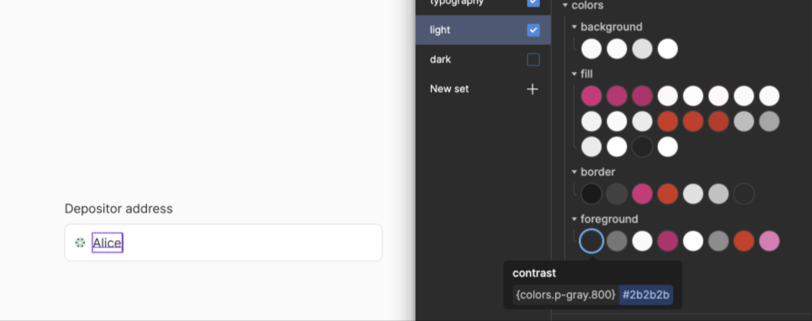

# Polkadot Design Tokens

Design tokens used by the Parity Product Design team synced to `/src/tokens/`

Output is generated (Style Dictionary) and published as a package. Note that this is a manual process, to be automated later.

Current outputs: CSS variables (global, light, dark) + Tailwind config

## Installation

Simply install the package by running:
with npm:
```
npm i polkadot-theme
```

or with yarn:
```
yarn add polkadot-theme
```

## Simple CSS usage

In order to use just the css color palette coming with the library you need to import in your main `css` the `polkadot-theme` main css files (`global`, `light`, `dark`) as can be seen below:

```
import "polkadot-theme/global.css"
import "polkadot-theme/light.css"
import "polkadot-theme/dark.css"
```

Then the defined [custom CSS properties](https://developer.mozilla.org/en-US/docs/Web/CSS/Using_CSS_custom_properties) can be used inside your `.css` files.

See the end of this file for the variables and the used colors;

## Use (Tailwind)

Copy tailwind config to root folder
`cp -r ./node_modules/polkadot-theme/tailwind.config.cjs ./`

Import css

```
App.tsx

import "polkadot-theme/global.css"
import "polkadot-theme/light.css"
import "polkadot-theme/dark.css"
```

Implement in components

```
Button.tsx - variant="ghost"

...
<button className="bg-fill-ghost border-border-hint text-foreground-contrast">
    Press me!
</button>
...
```

[Switch themes ->](https://github.com/dnlklmn/polkadot-theme#themeswitchtsx)

## Token API

### Global Colors

Entire range of colors used in the Polkadot theme.
Semantic always reference global colors.

### Semantic Colors

Background: for everything that is full screen and serves as a background for an interface

Fill: for UI elements that sit on top of the backgrounds

Border: for borders of UI elements

Foreground: for texts and icons

### Typography [WIP]

## Generating Output and Publishing Package

[Walkthrough ->](https://www.loom.com/share/b4418b5d2ad141c8807ccb1a8e1f4dcb?sid=bdea2444-287e-40eb-b7f9-fbd64edf612a)

0. push changes from Figma `file path: src/tokens/`
1. `npm run generate-output`
2. bump version in `package.json`
3. `npm i`
4. `npm publish`

---

### ThemeSwitch.tsx

```
import * as React from "react"

interface IconProps {
  height?: number
}

function setTheme(themeName: string) {
  localStorage.setItem("data-theme", themeName)
  document.documentElement.setAttribute("data-theme", themeName)
}

;(function () {
  if (localStorage.getItem("data-theme") === "dark") {
    setTheme("dark")
  } else {
    setTheme("light")
  }
  console.log(localStorage.getItem("data-theme"))
})()

function IconDark({ height }: IconProps) {
  return (
    <svg
      xmlns="http://www.w3.org/2000/svg"
      height={height || `24`}
      fill="var(--colors-foreground-contrast)"
      strokeLinecap="round"
      strokeLinejoin="round"
      strokeWidth="2"
      viewBox="0 0 28 29"
    >
      <path
        fillRule="evenodd"
        stroke="none"
        d="M17.284 2.194C10.573.44 3.71 4.458 1.956 11.17.202 17.881 4.22 24.744 10.932 26.499c6.29 1.643 12.71-1.782 14.938-7.742a1 1 0 00-1.584-1.113A7.189 7.189 0 1119.29 4.986a1 1 0 00.396-1.895 12.615 12.615 0 00-2.403-.896z"
        clipRule="evenodd"
      ></path>
    </svg>
  )
}

function IconLight({ height }: IconProps) {
  return (
    <svg
      xmlns="http://www.w3.org/2000/svg"
      height={height || `24`}
      fill="var(--colors-foreground-contrast)"
      strokeLinecap="round"
      strokeLinejoin="round"
      strokeWidth="2"
      viewBox="0 0 28 28"
    >
      <path
        fillRule="evenodd"
        stroke="none"
        d="M15.485 2a1 1 0 10-2 0v3a1 1 0 102 0V2zM14 8c-3.314 0-6 2.688-6 6.002a6.001 6.001 0 1012 0A6.001 6.001 0 0014 8zm0 14a1 1 0 011 1v3a1 1 0 11-2 0v-3a1 1 0 011-1zm-8-8a1 1 0 01-1 1H2a1 1 0 110-2h3a1 1 0 011 1zm20 1a1 1 0 100-2h-3a1 1 0 100 2h3zM8.343 19.657a1 1 0 010 1.414l-2.121 2.121a1 1 0 11-1.415-1.414l2.122-2.121a1 1 0 011.414 0zM23.678 6.222a1 1 0 00-1.415-1.414l-2.121 2.121a1 1 0 001.414 1.414l2.122-2.121zM8.828 8.343a1 1 0 01-1.414 0L5.293 6.222a1 1 0 011.414-1.414L8.83 6.929a1 1 0 010 1.414zm12.95 14.85a1 1 0 001.414-1.415l-2.12-2.121a1 1 0 00-1.415 1.414l2.121 2.121z"
        clipRule="evenodd"
      ></path>
    </svg>
  )
}

export default function ThemeSwitch() {
  const [currentTheme, setCurrentTheme] = React.useState(
    localStorage.getItem("data-theme"),
  )

  const toggleOn = () => {
    const theme = localStorage.getItem("data-theme")
    if (theme === "dark") {
      setTheme("light")
      setCurrentTheme("light")
    } else {
      setTheme("dark")
      setCurrentTheme("dark")
    }
  }

  return (
    <div onClick={toggleOn}>
      {currentTheme === "dark" ? (
        <IconDark height={20} />
      ) : (
        <IconLight height={20} />
      )}
    </div>
  )
}

```
------

# Variables and color palettes

## global.css:
```css
  --font-family-unbounded: Unbounded;
  --font-family-inter: Inter;
  --font-family-mono: Roboto Mono;
  --font-weight-bold: 700;
  --font-weight-regular: 400;
  --font-weight-semibold: Semi Bold;
  --colors-black: #171717;
  --colors-white: #ffffff;
  --colors-p-pink-50: #FFF8FC;
  --colors-p-pink-100: #ffe4f3;
  --colors-p-pink-200: #f9abd5;
  --colors-p-pink-300: #f272b6;
  --colors-p-pink-400: #FD1B93;
  --colors-p-pink-500: #e6007a;
  --colors-p-pink-600: #cb006c;
  --colors-p-pink-700: #a9005a;
  --colors-p-pink-800: #860047;
  --colors-p-pink-900: #640035;
  --colors-p-pink-950: #3f0021;
  --colors-p-gray-50: #fafafa;
  --colors-p-gray-100: #ebebeb;
  --colors-p-gray-200: #e1e1e1;
  --colors-p-gray-300: #c1c1c1;
  --colors-p-gray-400: #a1a1a1;
  --colors-p-gray-500: #8D8D8D;
  --colors-p-gray-600: #767676;
  --colors-p-gray-700: #414141;
  --colors-p-gray-800: #2b2b2b;
  --colors-p-gray-900: #1a1a1a;
  --colors-p-gray-950: #111111;
  --colors-p-red-50: #fffafa;
  --colors-p-red-100: #fff1f0;
  --colors-p-red-200: #fed2cd;
  --colors-p-red-300: #fe8d81;
  --colors-p-red-400: #fd4935;
  --colors-p-red-500: #e31902;
  --colors-p-red-600: #b21200;
  --colors-p-red-700: #7f0d00;
  --colors-p-red-800: #4c0800;
  --colors-p-red-900: #290400;
  --colors-p-red-950: #190300;
  --colors-p-white-transparent-100: #ffffff0f;
  --colors-p-white-transparent-200: #ffffff2b;
  --colors-p-white-transparent-300: #ffffff45;
  --colors-p-white-transparent-400: #ffffff61;
  --colors-p-white-transparent-500: #ffffff7a;
  --colors-p-white-transparent-600: #ffffff94;
  --colors-p-white-transparent-700: #ffffffb0;
  --colors-p-white-transparent-800: #ffffffc9;
  --colors-p-white-transparent-900: #ffffffe6;
  --colors-p-black-transparent-50: #00000008;
  --colors-p-black-transparent-100: #0000000f;
  --colors-p-black-transparent-200: #00000029;
  --colors-p-black-transparent-300: #00000040;
  --colors-p-black-transparent-400: #00000059;
  --colors-p-black-transparent-500: #00000070;
  --colors-p-black-transparent-600: #0000008c;
  --colors-p-black-transparent-700: #000000a8;
  --colors-p-black-transparent-800: #000000c7;
  --colors-p-black-transparent-900: #000000e3;
  --colors-accent-cyan-500: #00B2FF;
  --colors-accent-cyan-600: #00A6ED;
  --colors-accent-cyan-700: #0094D4;
  --colors-accent-green-500: #56f39a;
  --colors-accent-green-600: #51E591;
  --colors-accent-green-700: #48CC81;
  --colors-accent-lime-500: #d3ff33;
  --colors-accent-lime-600: #BEE52E;
  --colors-accent-lime-700: #A9CC29;
  --colors-p-purple-50: #fbfcfe;
  --colors-p-purple-100: #f3f5fb;
  --colors-p-purple-200: #e6eaf6;
  --colors-p-purple-300: #dae0f2;
  --colors-p-purple-400: #6d3aee;
  --colors-p-purple-500: #552bbf;
  --colors-p-purple-600: #442299;
  --colors-p-purple-700: #321d47;
  --colors-p-purple-800: #28123e;
  --colors-p-purple-900: #1c0533;
  --colors-p-purple-925: #160527;
  --colors-p-purple-950: #140523;
```

## light.css:
```css
  --colors-background-default: #fafafa;
  --colors-background-system: #fafafa;
  --colors-background-dip: #e1e1e1;
  --colors-background-float: #ffffff;
  --colors-fill-primary: #e6007a;
  --colors-fill-primary-hover: hsl(328 100% 41.7%);
  --colors-fill-primary-down: hsl(328 100% 39.5%);
  --colors-fill-secondary: #FFF8FC;
  --colors-fill-secondary-hover: color(display-p3 1 0.99 0.99);
  --colors-fill-secondary-down: #FFF8FC;
  --colors-fill-ghost: #fafafa;
  --colors-fill-ghost-hover: color(display-p3 0.98 0.98 0.98);
  --colors-fill-ghost-down: color(display-p3 0.95 0.95 0.95);
  --colors-fill-match-background: #fafafa;
  --colors-fill-disabled: #ebebeb;
  --colors-fill-danger: #e31902;
  --colors-fill-danger-hover: color(display-p3 0.8 0.2 0.12);
  --colors-fill-danger-pressed: color(display-p3 0.76 0.19 0.12);
  --colors-fill-elevate-1: #ffffffb0;
  --colors-fill-overlay: #ffffff94;
  --colors-fill-selected: #ebebeb;
  --colors-fill-white: #ffffff;
  --colors-fill-separator: #00000029;
  --colors-fill-elevate: #ffffff;
  --colors-border-contrast: #1a1a1a;
  --colors-border-dimmed: #414141;
  --colors-border-primary: #e6007a;
  --colors-border-danger: #e31902;
  --colors-border-hint: #e1e1e1;
  --colors-border-disabled: #c1c1c1;
  --colors-border-focus: #2b2b2b;
  --colors-foreground-contrast: #2b2b2b;
  --colors-foreground-dimmed: #767676;
  --colors-foreground-match-background: #fafafa;
  --colors-foreground-primary: #cb006c;
  --colors-foreground-white: #ffffff;
  --colors-foreground-disabled: #8D8D8D;
  --colors-foreground-danger: #e31902;
  --colors-foreground-emphasized: #f272b6;
  --colors-accent-cyan: #00D0FF;
  --colors-accent-green: #56F39A;
  --colors-accent-lime: #D3FF33;
  --colors-accent-random: #aaaaac;
  --box-shadow-pop: 0 8px 24px 0 #00000030;
  --box-shadow-idle: 0 2px 4px 0 #00000014;
  --box-shadow-hover: 0 8px 8px 0 #00000008;
  --boder-radius-lg: 16px;
```

## dark.css:
```css
  --colors-background-default: #1a1a1a;
  --colors-background-system: #111111;
  --colors-background-float: #2b2b2b;
  --colors-background-dip: #111111;
  --colors-fill-primary: #e6007a;
  --colors-fill-primary-hover: color(display-p3 0.74 0.16 0.43);
  --colors-fill-primary-down: color(display-p3 0.7 0.15 0.4);
  --colors-fill-secondary: color(display-p3 0.1 0.1 0.1);
  --colors-fill-secondary-hover: color(display-p3 0.12 0.12 0.12);
  --colors-fill-secondary-down: color(display-p3 0.1 0.1 0.1);
  --colors-fill-ghost: #2b2b2b;
  --colors-fill-ghost-hover: color(display-p3 0.15 0.15 0.15);
  --colors-fill-ghost-down: #2b2b2b;
  --colors-fill-match-background: #1a1a1a;
  --colors-fill-disabled: #2b2b2b;
  --colors-fill-danger: #e31902;
  --colors-fill-danger-hover: color(display-p3 0.8 0.2 0.12);
  --colors-fill-danger-pressed: color(display-p3 0.78 0.29 0.22);
  --colors-fill-elevate-1: #ffffffb0;
  --colors-fill-overlay: #ffffff94;
  --colors-fill-selected: #2b2b2b;
  --colors-fill-white: #ffffff;
  --colors-fill-separator: #ffffff2b;
  --colors-fill-elevate: #171717;
  --colors-border-contrast: #ebebeb;
  --colors-border-dimmed: #a1a1a1;
  --colors-border-primary: #e6007a;
  --colors-border-danger: #e31902;
  --colors-border-hint: #414141;
  --colors-border-disabled: #767676;
  --colors-border-focus: #2b2b2b;
  --colors-foreground-contrast: #fafafa;
  --colors-foreground-dimmed: #a1a1a1;
  --colors-foreground-match-background: #1a1a1a;
  --colors-foreground-primary: #FD1B93;
  --colors-foreground-white: #ffffff;
  --colors-foreground-disabled: #a1a1a1;
  --colors-foreground-danger: #fd4935;
  --colors-foreground-emphasized: #f272b6;
  --colors-accent-cyan: #00D0FF;
  --colors-accent-green: #56F39A;
  --colors-accent-lime: #D3FF33;
  --colors-accent-random: #abcabc;
  --box-shadow-pop: 0 8px 24px 0 #00000030;
  --box-shadow-idle: 0 2px 4px 0 rgba(0,0,0,0.85);
  --box-shadow-hover: 0 8px 8px 0 #00000008;
```